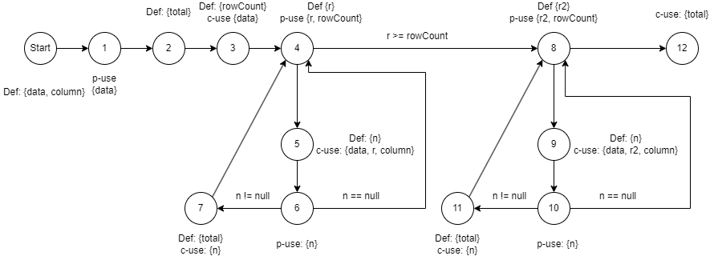
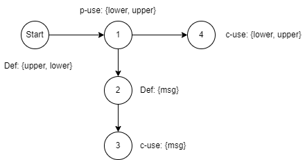
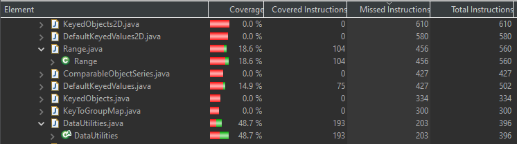
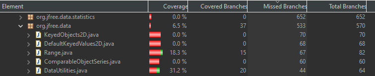
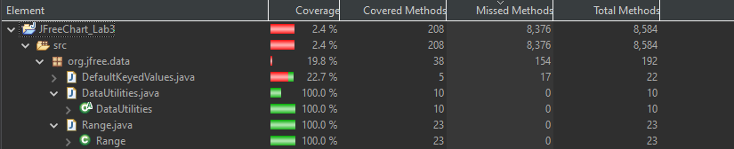
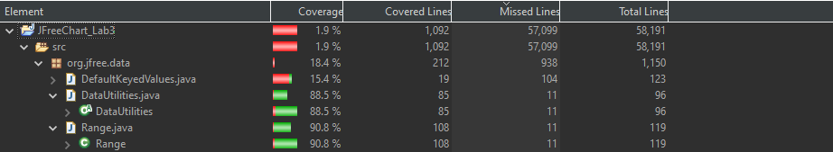
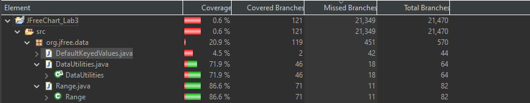
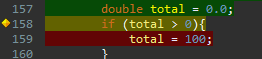
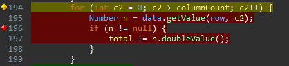

**SENG 637 - Dependability and Reliability of Software Systems**

**Lab. Report #3 – Code Coverage, Adequacy Criteria and Test Case Correlation**

| Group \#: 5      |     |
| -------------- | --- |
| Student Names: |     |
| Christopher Brunet |     |
| Christopher Proc |     |
| Sean Buchanan |     |

# 1 Introduction

The purpose of Lab 3 is to conduct white-box testing using code coverage tools in order to learn and demonstrate the ability to plan, execute, and evaluate a comprehensive test suite on a function System Under Test (SUT). We will build upon the test suite that was created during Lab 2, and continue expand the coverage of our test suite against the JFreeChart package as our SUT. 

# 2 Manual data-flow coverage calculations for DataUtilities.calculateColumnTotal and Range.getLength methods.

This section outlines the manual analysis of two methods, DataUtilities.calculateColumnTotal(), and Range.getLength(). Each method was manually evaluated on a line-by-line basis in order to build a Data Flow Graph, D-U pair list for each variable, and then we evaluated the coverage of our Lab 2 test cases. 

## Analysis of DataUtilities.calculateColumnTotal()

#### Data Flow Graph:

#### Definitions and Uses in each statement:
| Statement| Defined| Used|
|-----|-----|-----|
|0|data, column| |
|1| | data|
|2| total| | 
|3| rowCount| data|
|4| r| rowcount, r|
|5| n| data, r, column|
|6| | n| 
|7| total | n|
|8| r2| rowCount, r2|
|9| n| data, r2, column|
|10| | n|
|11| total | n|
|12| | total|

#### D-U Pairs by Variable:
| Variable | Pairs |
|----- | ----- |
| data | (0,1), (0,3), (0,5), (0,9) | 
| column | (0,5), (0,9)|
| total| (2,12), (7,12), (11,12) |
|rowCount|(3,4), (3,8) |
|r|(4,5)|
|n| (5,6), (5,7), (9,10), (9,11)|
|r2| (8,9)| 

#### Test Case D-U Coverage:
| Test Case| Covered D-U Pairs|
| ----- | ----- | 
| calculateColumnTotalNullDataShouldThrowException()| data (0,1)|
| calculateColumnTotalOfColumn0ShouldReturn3()| Data ((0,1), (0,3), (0,5), (0,9)), column ((0,5)), total ((7,12)), rowCount ((3,4), (3,8)), r (4,5), n ((5,6), (5,7)) |
|calculateColumnTotalOfColumn1ShouldReturn0()| Data ((0,1), (0,3), (0,5), (0,9)), column ((0,5)), total ((7,12)), rowCount ((3,4), (3,8)), r (4,5), n ((5,6), (5,7)) |
| calculateColumnTotalOfColumn2ShouldReturn3()|Data ((0,1), (0,3), (0,5), (0,9)), column ((0,5)), total ((7,12)), rowCount ((3,4), (3,8)), r (4,5), n ((5,6), (5,7)) |
|belowZeroColumnShouldThrowException()| column (0,5)|
|aboveColumnCountColumnShouldThrowException()| column (0,5)|
|Not Tested| column (0,9), total ((2,12), (11,12)), r2 (8,9), n ((9,10), (9,11))|

<b>Total D-U Coverage: 11/17 D-U Pairs = 64.7%</b>

## Analysis of Range.getLength():

#### Data Flow Graph:

#### Definitions and Uses in each statement:
| Statement| Defined| Used|
|-----|-----|-----|
|0| lower, upper| |
|1| | lower, upper|
|2| msg| | 
|3| | msg|
|4| | lower, upper|

#### D-U Pairs by Variable:
| Variable | Pairs |
|----- | ----- |
|lower| (0,1), (0,4)|
|upper| (0,1), (0,4)|
|msg| (2,3)|

#### Test Case D-U Coverage:
| Test Case| Covered D-U Pairs|
| ----- | ----- | 
|getLengthPosPosRange()| lower((0,1), (0,4)), upper ((0,1), (0,4)) |
|getLengthZeroPosRange()| lower((0,1), (0,4)), upper ((0,1), (0,4)) |
|getLengthNegZeroRange() | lower((0,1), (0,4)), upper ((0,1), (0,4)) |
|getLengthNegNegRange()| lower((0,1), (0,4)), upper ((0,1), (0,4)) |
|getLengthNegPosRange()| lower((0,1), (0,4)), upper ((0,1), (0,4)) |
|getLengthZeroLengthRange()| lower((0,1), (0,4)), upper ((0,1), (0,4)) |
|getLengthInfInfRange()| lower((0,1), (0,4)), upper ((0,1), (0,4)) |
| Not Tested| msg(2,3)|

<b>Total D-U coverage: 4/5 = 80%</b>

# 3 A detailed description of the testing strategy for the new unit test

## 1. Test Strategy
### Scope of Testing
All testing will be done on the SUT, JFreeChart version 1.0.19
#### Features to be tested
    Testing will be limited to all methods included in:
    -  org.jfree.data.DataUtilities
    -  org.jfree.data.Range

#### Features not to be tested
    Testing excludes all methods and classes included within JFreeChart that are not listed above. 

### Type of Testing    
    Unit Testing - White Box.

    Testers will have access to inspect source code.

### Who will test
    Test case design and implementation will be split evenly between the three group members.

## 2. Test Objective
    The objective of this test plan is to analyze the current coverage of the SUT and features to be tested against three metrics:
    - Statement Coverage
    - Branch Coverage
    - Condition Coverage

    Testers will then enhance the current test suite with enough test cases to ensure that we have achieved a high level of coverage across all three metrics for each of the two selected classes. Testers should use best judgement and careful analysis in order to select test cases which maximize the coverage per test case in order to efficiently accomplish this test plan.

    General guidance is to first develop comprehensive unit tests for all untested methods. Then conduct further analysis in order to see where further coverage is needed. 
## 3. Test Criteria
    This test phase will be considered successful when the two featured classes achieve the following metrics: 
    - 90% Statement Coverage
    - 70% Branch Coverage
    - 60% Condition Coverage.

## 4. Deliverables

    Testers will deliver: 
    - functioning source code which encompasses the test runner, and all of the individual unit tests for the Range and DataUtilities classes, specifically.
    - An analysis of the final coverage of the classes under test.
    - A detailed description of five individual unit tests
    - A report on the execution of the test plan.

# 4 A high level description of five selected test cases you have designed using coverage information, and how they have increased code coverage

Text…

# 5 A detailed report of the coverage achieved of each class and method (a screen shot from the code cover results in green and red color would suffice)

### Initial Coverage from the Lab 2 Test Suite

As shown in the screenshots below, the original coverages were as follows:
- Range: Statement Coverage (18.6%), Branch Coverage (18.3%)
- Data Utilities; Statement Coverage(48.7%), Branch Coverage (31.2%)

### Final Coverage from the Lab 3 Test Suite

As shown in the screenshots below, our updated test suite for Lab 3 now achieves the following coverages:

Method Coverage: 
- Range (100%)
- DataUtilities(100%)

Line Coverage: 
- Range (90.8%)
- DataUtilities (88.5%)

Branch Coverage:
- Range(86.6%)
- DataUtilities (71.9%)

Of note, we hit every required metric from the test plan, with the exception of Line Coverage for DataUtilities (88.5% vs 90%).
This was due to the fact that DataUtilities had a number of lines of code which were inacessible to the testers, as shown in the screnshots below. There is no logic or valid set of object parameters that are possible in order to access these lines, and they are good candidates to be removed. 

# 6 Pros and Cons of coverage tools used and Metrics you report

## Coverage Tools
### EclEmma

#### Pros
- Very easy integration with Eclipse.
- Intuitive to use.

#### Cons
- Lacks good documentation about certain features, or detailed definitions of certain metrics.
- No condition coverage metric

### Code Cover
#### Pros
- Supports condition coverage metrics
#### Cons
- Eclipse plugin installation website no longer hosted, could not install.

### Clover

### Pros
- Now an open source project
### Cons
- No longer supported or updated by Atlassian. 
## Reporting Metrics
### Line Coverage
Line coverage was very effective in ensuring that we explored nearly all of the statements in the code, and was a good metric for testing the correctness of individual statements. It was also effective at finding situations in the code where the logic made it impossible to enter a code block.

It does not provide a good metric for confirming data flow and logic, as incorrect values and logic will still show as successful executions of a line. 

### Method Coverage
A baseline metric, Method coverage was useful in ensuring that testing does not miss any major features of the class, however it does not provide enough granularity in order to ensure that the entire class is tested effectively. 

### Branch Coverage
Branch coverage was very effective in identifying places in the code where we had failed to fully test the conditional uses of our variables. It provides a good metric for testing the logical flow of our program. It also lent itself very well to providing good candiates for input values for the unit tests.

A major drawback of branch coverage was the fact that some branches are failure-handing branches, and should not necessarily be entered through normal code flow, or are guarded by other checks. These branches were unable to be tested directly. 

### Condition Coverage
Condition Coverage is closely related to branch coverage, as boolean conditions are most often used in branch determination. Where it differs is in fully evaluating all possible True/False condition combinations at each of these junctions. This metric seems like it could be better addressed when required through a truth-table analysis, as many combinations of boolean values will often be identical with respect to code execution. Unfortunately, none of the tools that we were able to install could provide condition coverage. Code Cover supports this metric, but we were unable to install and use the tool.

### Conclusion

Ultimately, the lab has shown us that it it best to rely on a combination of these metrics in order to ensure that the feature we are testing is fully covered and adequately explored. 

# 7 A comparison on the advantages and disadvantages of requirements-based test generation and coverage-based test generation.

During this lab, we focused mainly on coverage-based analysis and test generation. Talk about how coverage-based test generation doesn't necessarily determine if the code is meeting the requirements.

# 8 A discussion on how the team work/effort was divided and managed

Initially, each member of the group completed the steps to setup and import the previous Lab into a new project, and install all of the dependencies. Each member completed the familiarization portion of the Lab in order to gain sufficient understanding to contribute to the lab work. 

The group worked closely together to complete the analysis of the DU-pairs and DFG diagrams in section 2. This allowed us to discuss and check the work together, and to come to a common understanding of the type of analysis that would help our design of the unit tests. The entire group then discussed and agreed upon the high level testing plan created in section 3.

Members then split off individually in order to build extra test cases as needed in order to achieve the required coverage of the SUT, as stated in the Lab instructions. While this part was done individually, close communication was necessary in order to prevent any duplication of effort. The individual test cases were then compile when completed, and the final analysis of the test coverage was done as a group.

All team members contributed equally throughout the lab work itself, and in the writing of the report.

# 9 Any difficulties encountered, challenges overcome, and lessons learned from performing the lab

Difficulties and Challenges:
- It was occasionally difficult during this project to deal with managing the iteration from Lab 2. Some of the dependency libraries used different versions of utilities, which led to some conflicts and overlap when trying to package the complete Lab3.  
- Some of the code coverage tools are legacy and are no longer supported, or are unavailable. It was hard to find recent sources of information or troubleshooting on some (Code Coverage), and some had been turned into unsuppported open source projects (Clover)
- Having separate github repositories for each group member rather than branches or forks made it difficult to share and version control our code at times. 

Lessons Learned:
- We learned how important it is to keep test suites neat, organized, and well commented. While it was convenient to continue writing test cases in a single test suite, it became very difficult after a while to locate and identify specific tests relating to individual methods or use cases. In hindsight, it may have been more effective to invest time up front to breaking down the test cases into smaller packages according to method, in order to keep them more accessible and organized. 

# 10 Comments/feedback on the lab itself
- Overall the lab was very well designed, and gave us a good overview of white-box testing and code coverage. We really appreciated the effort that was made to provide complete and detailed instructions for setting up the environment. The lab was very effective in teaching the concepts required.

- As mentioned in section 9, some of the tools mentioned in the lab are getting quite dated. While EclEmma is still supported and was very effective for this lab, it may be helpful to do a review and refresh of the tools used in this lab in order to see if current trends have moved to different tools.  
